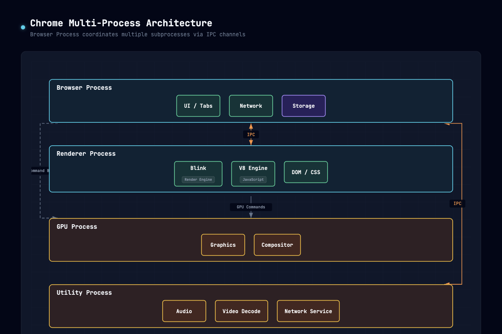
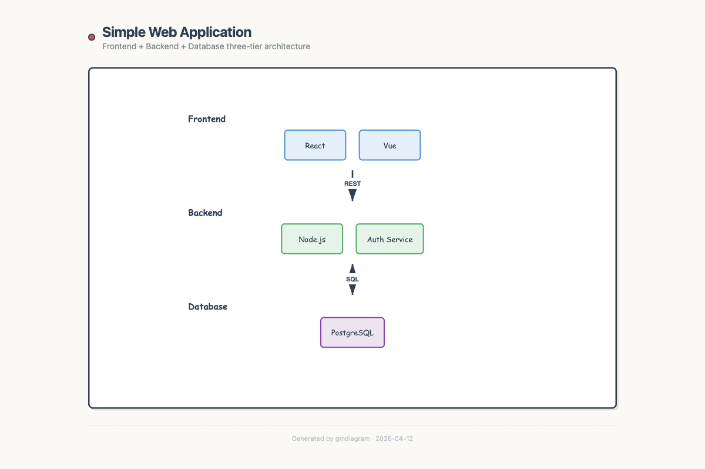
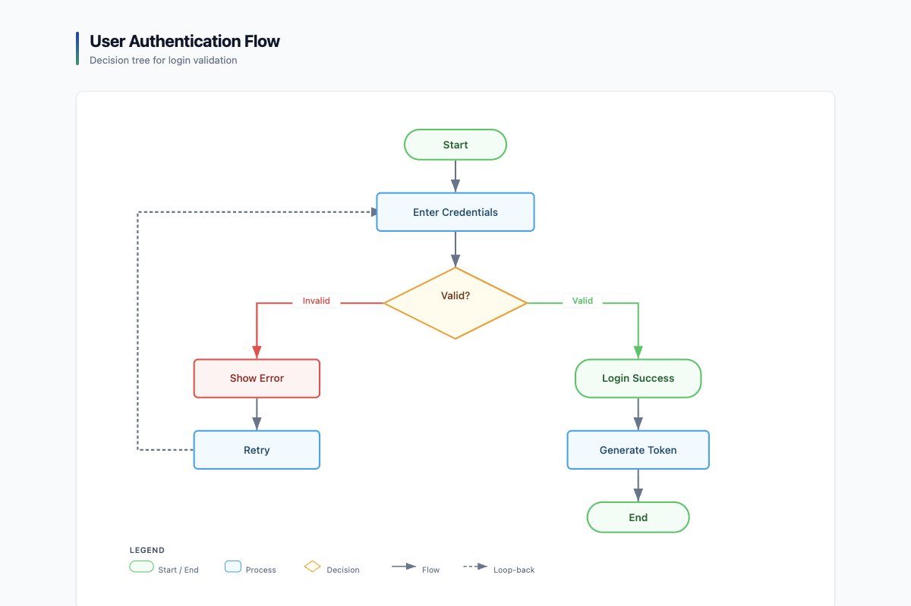
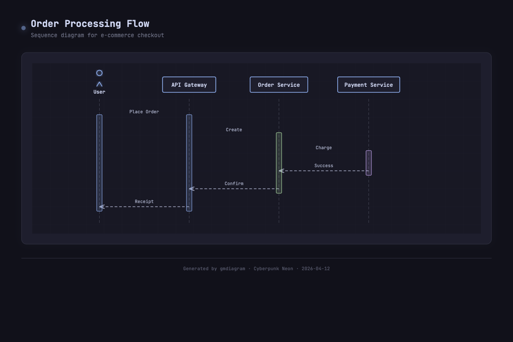
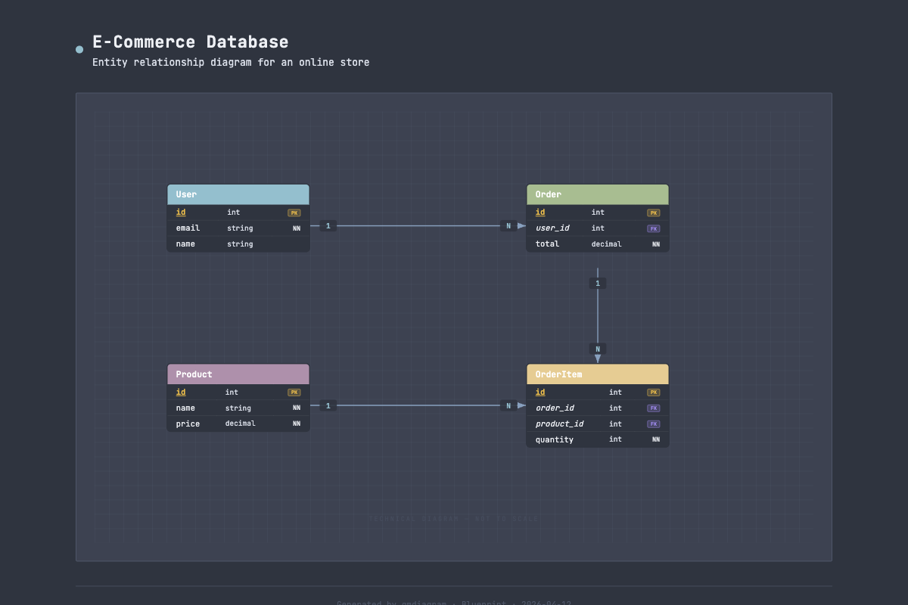
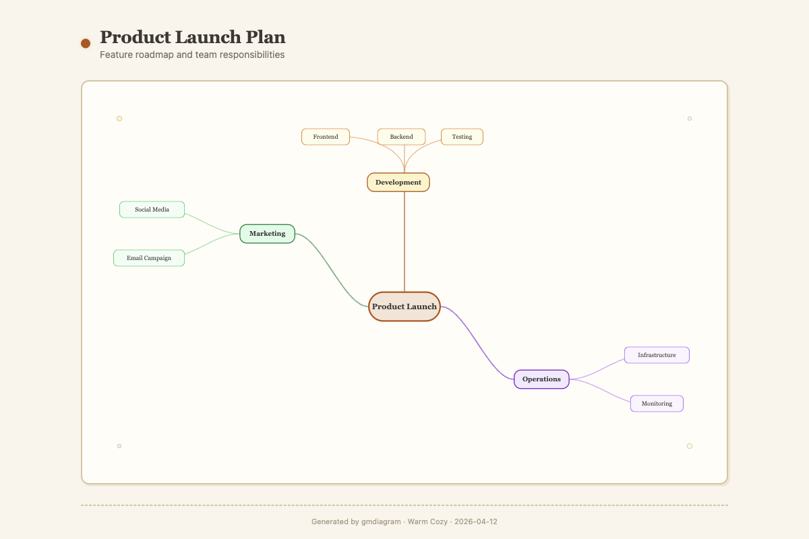

# gmdiagram — Architecture Diagram Skill

A Claude Code skill that generates professional diagrams from natural language descriptions. Supports 5 diagram types, 6 visual styles, and 4 output formats.

Source repository: `https://github.com/ZeroZ-lab/gmdiagram`

## Features

- **5 diagram types**: Architecture, Flowchart, Mind Map, ER Diagram, Sequence Diagram
- **6 visual styles**: Dark Professional, Hand-Drawn Sketch, Light Corporate, Cyberpunk Neon, Blueprint, Warm Cozy
- **4 output formats**: HTML, SVG, Mermaid, PNG/PDF (via export script)
- **150+ icons**: Curated from Tabler Icons and Simple Icons for richer visual expression
- **Structured generation**: Two-step process (JSON schema → output) for reliable results
- **Self-contained output**: Single file, no JavaScript, no external dependencies

## Quick Start

### Install

Clone this repository, add it as a local Claude Code marketplace, then install the `architecture-diagram` plugin from that marketplace:

```bash
/plugin marketplace add ZeroZ-lab/gmdiagram
/plugin install architecture-diagram@gmdiagram-marketplace
```

### Use

Just ask Claude to create a diagram:

```
> Draw an architecture diagram of Chrome's multi-process system

> Create a flowchart for a CI/CD pipeline with build, test, and deploy stages

> Generate a mind map for full-stack developer learning roadmap

> Design an ER diagram for an e-commerce database

> Draw a sequence diagram for user login authentication flow

> 画一个微服务架构图，包含 API Gateway、用户服务、订单服务
```

## Diagram Types

| Type | Trigger Keywords | Best For |
|------|-----------------|----------|
| **Architecture** | system, layered, infrastructure, 架构图 | System tiers, services, platforms |
| **Flowchart** | flow, decision, process, algorithm, 流程图 | Decision trees, process flows |
| **Mind Map** | brainstorm, hierarchy, feature tree, 思维导图 | Topic overview, roadmaps |
| **ER Diagram** | database, entity, table, schema, ER图 | Data models, database design |
| **Sequence** | API flow, message, interaction, 时序图 | Protocol flows, API calls |

## Examples

Each of the 6 visual styles applied to a different diagram type:

<table>
<tr>
<td width="50%" align="center">
<br/>
<b>Chrome Architecture</b><br/>
<sup>Architecture · <b>Dark Professional</b> · 4 layers · 8 modules</sup>
</td>
<td width="50%" align="center">
<br/>
<b>Simple Web Application</b><br/>
<sup>Architecture · <b>Hand-Drawn Sketch</b> · 3 tiers · 4 modules</sup>
</td>
</tr>
<tr>
<td width="50%" align="center">
<br/>
<b>User Authentication Flow</b><br/>
<sup>Flowchart · <b>Light Corporate</b> · 8 nodes · 2 decisions</sup>
</td>
<td width="50%" align="center">
<br/>
<b>Order Processing</b><br/>
<sup>Sequence · <b>Cyberpunk Neon</b> · 5 actors · 9 messages · 1 loop</sup>
</td>
</tr>
<tr>
<td width="50%" align="center">
<br/>
<b>E-Commerce Database</b><br/>
<sup>ER Diagram · <b>Blueprint</b> · 6 entities · 6 relationships</sup>
</td>
<td width="50%" align="center">
<br/>
<b>Product Strategy</b><br/>
<sup>Mind Map · <b>Warm Cozy</b> · 3 levels · 15+ nodes</sup>
</td>
</tr>
</table>

## Visual Styles

| Style | Background | Best For |
|-------|-----------|----------|
| **Dark Professional** | Deep dark (#020617) | Technical articles, docs |
| **Hand-Drawn Sketch** | Light beige (#faf8f5) | Teaching, brainstorming |
| **Light Corporate** | White (#f8fafc) | Business presentations |
| **Cyberpunk Neon** | Catppuccin dark (#11111b) | Developer tools, tech content |
| **Blueprint** | Nord dark (#2e3440) | Engineering specs, infra docs |
| **Warm Cozy** | Warm cream (#f9f5eb) | Tutorials, non-technical audiences |

## Output Formats

| Format | Description | Command |
|--------|-------------|---------|
| **HTML** | Single file with inline SVG (default) | Specify `format: "html"` or omit |
| **SVG** | Standalone SVG for vector editors | Specify `format: "svg"` |
| **Mermaid** | Text syntax for GitHub/Notion | Specify `format: "mermaid"` |
| **PNG/PDF** | Image export via script | `./scripts/export.sh diagram.html --format png` |

### PNG/PDF Export

```bash
# Requirements: Node.js (PNG) or rsvg-convert (PDF)
./scripts/export.sh diagram.html --format png
./scripts/export.sh diagram.html --format pdf
./scripts/export.sh diagram.svg --format png --output my-diagram.png
```

## Icons

Add icons to any component via the `"icon"` field:
```json
{ "id": "api-server", "label": "API Server", "type": "module", "icon": "tabler-server" }
```

150+ icons available in `references/icons-catalog.md`, organized by category:
- **Compute**: server, database, cloud, cpu, terminal, code
- **Networking**: globe, wifi, network, link, route
- **Security**: lock, shield, key, fingerprint
- **Users**: user, users, sitemap, hierarchy
- **Data**: table, file, folder, chart-bar, analytics
- **General**: settings, home, dashboard, search, rocket
- **Brands**: docker, kubernetes, react, aws, postgresql, github, nginx

## File Structure

```
architecture-diagram/
├── .claude-plugin/
│   └── plugin.json                   # Plugin manifest
├── README.md                         # Plugin overview
└── skills/
    └── architecture-diagram/
        ├── SKILL.md                  # Core instructions + dispatcher
        ├── README.md                 # This file
        ├── references/
│   ├── design-system.md              # Colors, typography, spacing, icons
│   ├── diagram-type-registry.md      # All diagram types registry
│   ├── icons-catalog.md              # 150+ SVG icon paths
│   ├── output-svg.md                 # SVG output format rules
│   ├── output-mermaid.md             # Mermaid output format rules
│   ├── output-png-pdf.md             # PNG/PDF export instructions
│   │
│   │ # Architecture
│   ├── schema-architecture.md        # Architecture schema docs
│   ├── diagram-architecture.md       # Architecture workflow
│   ├── layout-rules.md               # Architecture coordinate rules
│   ├── component-templates.md        # Architecture SVG snippets
│   │
│   │ # Flowchart
│   ├── diagram-flowchart.md
│   ├── layout-flowchart.md
│   ├── components-flowchart.md
│   │
│   │ # Mind Map
│   ├── diagram-mindmap.md
│   ├── layout-mindmap.md
│   ├── components-mindmap.md
│   │
│   │ # ER Diagram
│   ├── diagram-er.md
│   ├── layout-er.md
│   ├── components-er.md
│   │
│   │ # Sequence Diagram
│   ├── diagram-sequence.md
│   ├── layout-sequence.md
│   ├── components-sequence.md
│   │
│   │ # Style guides (shared)
│   ├── style-dark-professional.md
│   ├── style-hand-drawn.md
│   ├── style-light-corporate.md
│   ├── style-cyberpunk-neon.md
│   ├── style-blueprint.md
│   └── style-warm-cozy.md
│
├── assets/
│   ├── schema-architecture.json      # Architecture JSON Schema
│   ├── schema-flowchart.json
│   ├── schema-mindmap.json
│   ├── schema-er.json
│   ├── schema-sequence.json
│   ├── template-dark.html
│   ├── template-sketch.html
│   ├── template-light-corporate.html
│   ├── template-cyberpunk-neon.html
│   ├── template-blueprint.html
│   ├── template-warm-cozy.html
│   └── examples/
│
└── scripts/
    ├── export.sh
    └── package.json
```

## How It Works

```
Natural Language → [LLM extracts] → JSON Schema → [Layout rules] → SVG → Output format
```

1. **Schema first**: Structure captured in JSON (layers/nodes/entities/actors + connections)
2. **Rendering second**: Layout rules compute coordinates, SVG components assembled
3. **Output**: Wrapped in HTML, or output as standalone SVG, Mermaid text, or PNG/PDF

## License

MIT
