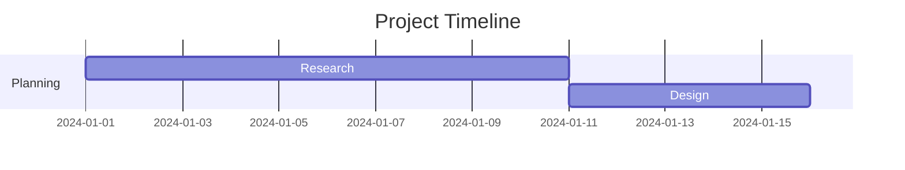

# Gantt Chart — Diagram Reference

## Type Identifier

`gantt`

## Trigger Keywords

gantt, timeline, schedule, milestone, project plan, 甘特图, 时间线, 项目计划

## Two-Step Generation

### Step 1: JSON Schema

Extract structure into `assets/schema-gantt.json`.

Key fields:
- `tasks[]`: Array of task objects (id, label, start, duration, progress, dependencies, milestone, group)
- `timeAxis`: Time unit (days/weeks/months) and optional range
- `connections`: Implicit from `dependencies` field on tasks

### Step 2: Render Output

1. Read style template and reference
2. Compute layout using `references/layout-gantt.md`
3. Build components using `references/components-gantt.md`
4. Wrap in HTML template

## Schema File

`assets/schema-gantt.json`

## Layout Rules

`references/layout-gantt.md`

## Component Templates

`references/components-gantt.md`

## Style Mapping

All 12 styles supported. Template mapping:
- Same as architecture diagram style mapping

## Mermaid Output

Use the `gantt` keyword:

