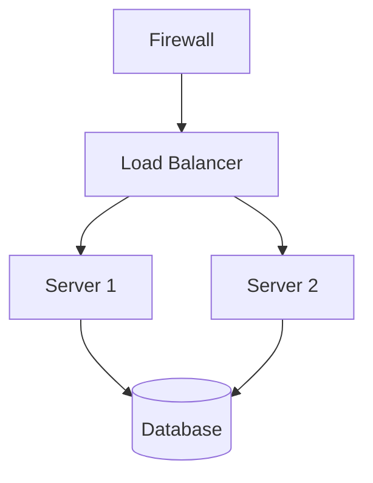

# Network Topology — Diagram Reference

## Type Identifier

`network`

## Trigger Keywords

network, topology, infrastructure, server, router, subnet, VLAN, firewall, 网络拓扑, 网络架构, 服务器, 路由器

## Two-Step Generation

### Step 1: JSON Schema

Extract structure into `assets/schema-network.json`.

Key fields:
- `nodes[]`: Array of node objects (id, label, type, ip, group, icon)
- `connections[]`: Array of connection objects (from, to, type, bandwidth, redundant)
- `zones[]`: Optional grouping of nodes into visual zones (subnet, region, etc.)

### Step 2: Render Output

1. Read style template and reference
2. Compute layout using `references/layout-network.md`
3. Build components using `references/components-network.md`
4. Wrap in HTML template

## Schema File

`assets/schema-network.json`

## Layout Rules

`references/layout-network.md`

## Component Templates

`references/components-network.md`

## Mermaid Output

Use the `graph` keyword:

Node shapes:
- `[]` for servers/routers/switches (rectangle)
- `[()]` for databases (cylinder)
- `(()) for cloud (circle)
