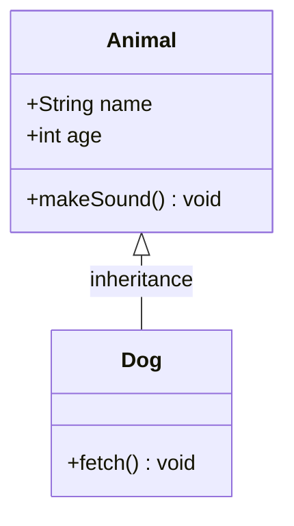

# UML Class Diagram — Diagram Reference

## Type Identifier

`uml-class`

## Trigger Keywords

UML, class diagram, OOP, inheritance, interface, abstract class, composition, 类图, UML图, 继承关系, 接口

## Two-Step Generation

### Step 1: JSON Schema

Extract structure into `assets/schema-uml-class.json`.

Key fields:
- `classes[]`: Array of class objects (id, name, stereotype, attributes[], methods[])
- `relationships[]`: Array of relationship objects (from, to, type, label, multiplicity)

### Step 2: Render Output

1. Read style template and reference
2. Compute layout using `references/layout-uml-class.md`
3. Build components using `references/components-uml-class.md`
4. Wrap in HTML template

## Schema File

`assets/schema-uml-class.json`

## Layout Rules

`references/layout-uml-class.md`

## Component Templates

`references/components-uml-class.md`

## Mermaid Output

Use the `classDiagram` keyword:

