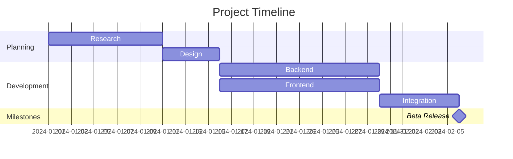
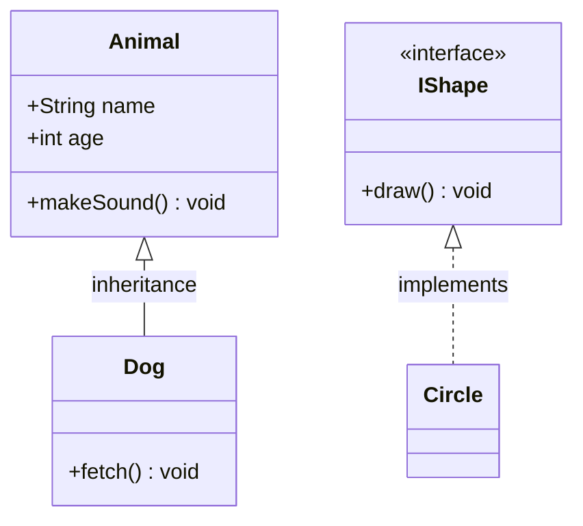
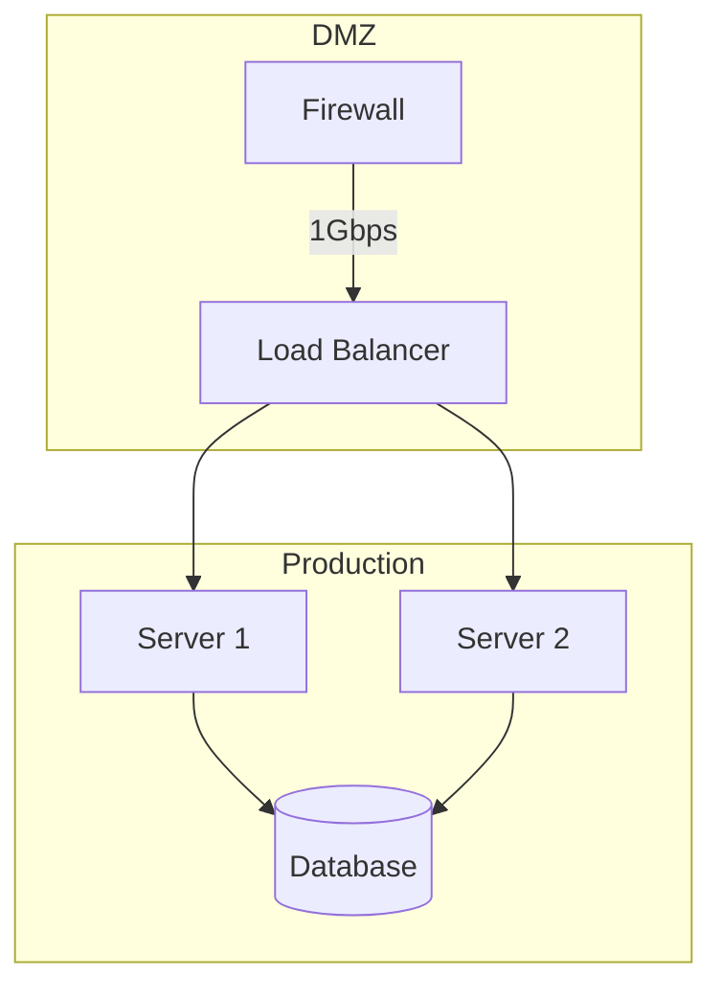

# Mermaid Output Format Reference

## When to Use

- User requests Mermaid syntax
- User wants to paste into GitHub README, Notion, or Markdown
- User wants editable text-based diagrams

## Style Mapping

Map gmdiagram styles to Mermaid themes:

| gmdiagram Style | Mermaid Theme |
|----------------|---------------|
| dark-professional | `%%{init: {theme: 'dark'}}%%` |
| hand-drawn | `%%{init: {theme: 'default'}}%%` |
| light-corporate | `%%{init: {theme: 'default'}}%%` |
| cyberpunk-neon | `%%{init: {theme: 'dark'}}%%` |
| blueprint | `%%{init: {theme: 'dark'}}%%` |
| warm-cozy | `%%{init: {theme: 'default'}}%%` |
| minimalist | `%%{init: {theme: 'base'}}%%` |
| terminal-retro | `%%{init: {theme: 'dark'}}%%` |
| pastel-dream | `%%{init: {theme: 'base'}}%%` |
| notion | `%%{init: {theme: 'base'}}%%` |
| material | `%%{init: {theme: 'base'}}%%` |
| glassmorphism | `%%{init: {theme: 'base'}}%%` |

For custom colors, add `classDef`:
```
classDef process fill:#0f172a,stroke:#22d3ee,color:#e2e8f0
classDef module fill:#0f172a,stroke:#34d399,color:#e2e8f0
classDef data fill:#0f172a,stroke:#a78bfa,color:#e2e8f0
```

## Architecture → Mermaid

```
graph TD
  subgraph Browser Process
    UI[UI / Tabs]
    NET[Network]
    STO[Storage]
  end
  subgraph Renderer Process
    BLK[Blink]
    V8[V8 Engine]
  end
  UI -->|IPC| BLK
```

Rules:
- Each layer → `subgraph`
- Each module → `id[Label]` (rectangle)
- Connections → arrows with optional `|label|`
- Groups → nested subgraphs

## Flowchart → Mermaid

```
graph TD
  START([Start]) --> COMMIT[Code Commit]
  COMMIT --> BUILD[Build]
  BUILD --> TEST{Unit Tests Pass?}
  TEST -->|Yes| INT[Integration Test]
  TEST -->|No| COMMIT
  INT --> END([End])
```

Rules:
- start/end → `id([Label])` (stadium)
- process → `id[Label]` (rectangle)
- decision → `id{Label}` (diamond)
- io → `id[/Label/]` (parallelogram)
- Branch labels → `-->|label|`
- Loop-back → arrow pointing to earlier node

## Mind Map → Mermaid (v10+)

```
mindmap
  root((gmdiagram))
    Diagram Types
      Architecture
      Flowchart
      Mind Map
      ER Diagram
      Sequence
    Visual Styles
      Dark Professional
      Hand Drawn
```

Rules:
- Use `mindmap` keyword
- `root((Label))` for central node
- Indentation for hierarchy

## ER Diagram → Mermaid

```
erDiagram
  USER {
    int id PK
    string email
    string name
  }
  ORDER {
    int id PK
    int user_id FK
    date created_at
  }
  USER ||--o{ ORDER : "has many"
```

Rules:
- Entity: name + curly brace block with attributes
- PK/FK annotations after type
- Relationships: `||--o{` (1:N), `||--||` (1:1), `}o--o{` (M:N)

## Sequence Diagram → Mermaid

```
sequenceDiagram
  participant User
  participant Client
  participant AuthServer
  User->>Client: Enter credentials
  Client->>AuthServer: POST /login
  AuthServer-->>Client: Token
  alt valid credentials
    Client->>User: Dashboard
  else invalid
    Client->>User: Error
  end
```

Rules:
- `participant` for actors
- `->>` sync, `--)>>` async, `-->>` return
- `alt/else/end`, `loop/end`, `opt/end` for fragments
- `activate`/`deactivate` for activation boxes

## Gantt Chart → Mermaid



Rules:
- Use `gantt` keyword
- `dateFormat` directive (e.g., `YYYY-MM-DD`)
- `section` for grouping tasks
- Task: `Label :id, start, duration`
- `after id` for dependencies
- Milestone: add `milestone` keyword, zero duration

## UML Class Diagram → Mermaid



Rules:
- Use `classDiagram` keyword
- Class: `class Name { attributes methods }`
- Visibility: `+` public, `-` private, `#` protected
- Stereotype: `<<interface>>` inside class
- Inheritance: `Class <|-- Subclass`
- Implementation: `Interface <|.. Class`
- Composition: `Class1 *-- Class2`
- Aggregation: `Class1 o-- Class2`
- Association: `Class1 --> Class2`
- Dependency: `Class1 ..> Class2`

## Network Topology → Mermaid



Rules:
- Use `graph TB` or `graph LR` keyword
- Standard boxes: `id[Label]`
- Databases: `id[(Label)]`
- Cloud: `id((Label))`
- Connections: `-->` with optional `|label|` for bandwidth/type
- Zones → `subgraph ZoneName ... end`

## General Rules

1. Always start with theme directive: `%%{init: {theme: '...'}}%%`
2. Icons are omitted (not supported in Mermaid)
3. Keep node IDs short and uppercase
4. Include all connections from the JSON
5. Output wrapped in ` ```mermaid ` code block
6. Swimlanes → subgraphs
7. Legend → comment at top
